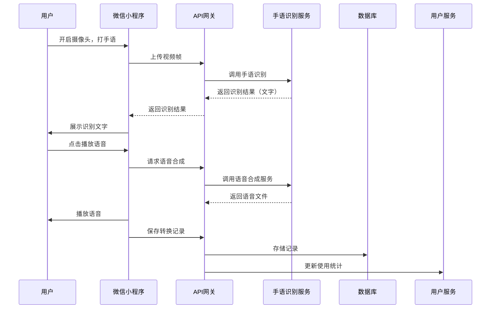
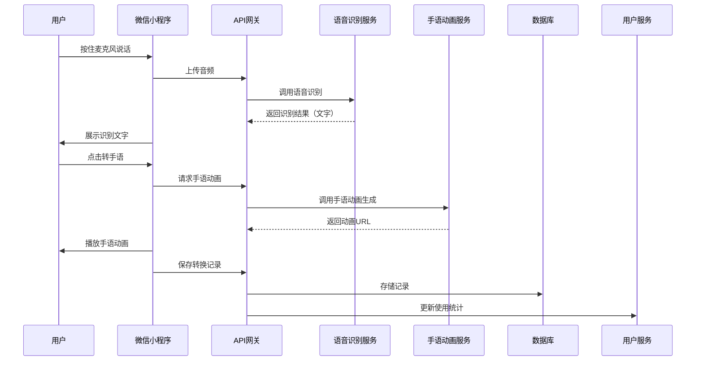
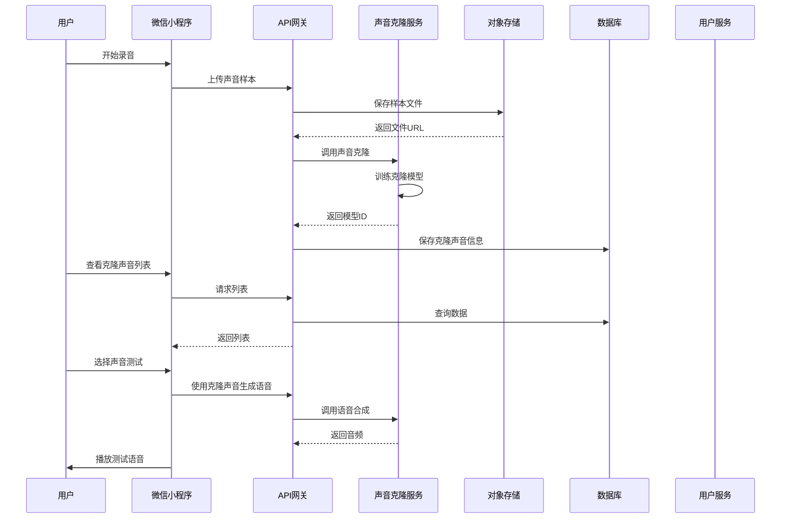

# 技术架构设计文档 - 手语AI智能平台

## 1. 架构概述

### 1.1 架构目标

**可扩展性**: 采用微服务架构，各功能模块解耦，便于独立扩展和升级。新增语音识别、手语识别等AI能力时可集成新服务节点。

**高可用性**: 微信小程序前端结合云服务架构，通过服务冗余和请求队列机制保障服务连续性，确保核心功能稳定可用。

**可维护性**: 模块化设计，清晰的分层架构和接口定义，便于维护和功能迭代。

### 1.2 架构原则

- **单一职责原则**: 每个服务模块专注于特定功能领域，避免职责混淆
- **开闭原则**: 系统对扩展开放，对修改关闭，通过接口抽象支持新功能接入
- **里氏替换原则**: 相同接口的不同AI服务实现可以互换使用
- **接口隔离原则**: 各模块通过明确的功能接口交互，避免不必要的依赖
- **依赖倒置原则**: 业务层依赖抽象接口，具体实现由AI服务提供方负责

## 2. 系统架构

### 2.1 整体架构图

```mermaid
graph TB
    subgraph 前端层
        A[微信小程序]
        A1[首页组件]
        A2[手语识别模块]
        A3[语音识别模块]
        A4[语音转手语模块]
        A5[手语转语音模块]
        A6[声音克隆模块]
        A7[语音生成模块]
        A8[历史记录模块]
        A9[个人中心模块]
    end

    subgraph API网关层
        B[API网关服务]
    end

    subgraph 业务服务层
        C1[用户服务]
        C2[转换记录服务]
        C3[克隆声音服务]
        C4[统计服务]
    end

    subgraph AI服务层
        D1[手语识别服务]
        D2[语音识别服务]
        D3[语音合成服务]
        D4[声音克隆服务]
        D5[手语动画服务]
    end

    subgraph 数据持久层
        E1[关系型数据库]
        E2[对象存储]
        E3[缓存服务]
    end

    subgraph 外部服务
        F1[微信开放平台]
        F2[第三方AI服务商]
    end

    A A1 & A2 & A3 & A4 & A5 & A6 & A7 & A8 & A9 --> B
    B --> C1
    B --> C2
    B --> C3
    B --> C4
    C1 --> E1
    C1 --> E3
    C2 --> E1
    C2 --> E3
    C3 --> E1
    C4 --> E1
    C1 --> F1
    D1 --> F2
    D2 --> F2
    D3 --> F2
    D4 --> F2
    D5 --> F2
    B --> D1
    B --> D2
    B --> D3
    B --> D4
    B --> D5
    C3 --> E2
```

### 2.2 架构分层

#### 2.2.1 表示层

**微信小程序**: 作为前端应用载体，提供用户交互界面
- 技术栈: 微信小程序原生开发框架
- 职责: 用户界面展示、用户交互处理、设备硬件调用（摄像头、麦克风）

#### 2.2.2 业务层

**微服务架构**: 按业务领域拆分服务，职责清晰
- **用户服务**: 用户认证、用户信息管理、用户设置
- **转换记录服务**: 各类转换记录的存储、查询、删除
- **克隆声音服务**: 声音模型的保存、管理、使用
- **统计服务**: 用户使用数据统计

#### 2.2.3 数据层

**关系型数据库**: 存储结构化业务数据
- 用途: 用户信息、转换记录、声音模型元数据、统计数据
- 类型: MySQL/PostgreSQL
- 理由: 支持复杂查询、事务处理、数据完整性保障

**对象存储**: 存储非结构化文件数据
- 用途: 手语视频文件、声音样本文件、音频输出文件
- 类型: 云存储服务（如OSS/COS）
- 理由: 大文件存储、高可靠性、CDN加速

**缓存服务**: 提升数据访问性能
- 用途: 用户会话、热点数据缓存
- 策略: Redis缓存用户信息，减少数据库访问压力

## 3. 服务设计

### 3.1 服务拆分

| 服务名称 | 职责 | 技术栈 | 数据库 |
|----------|------|--------|--------|
| 用户服务 | 微信授权登录、用户信息管理、用户设置管理 | Node.js / Python Flask | MySQL/PostgreSQL |
| 转换记录服务 | 手语识别、语音识别等转换记录的增删改查 | Node.js / Python Flask | MySQL/PostgreSQL |
| 克隆声音服务 | 声音模型元数据管理、声音模型关联关系 | Node.js / Python Flask | MySQL/PostgreSQL |
| 统计服务 | 用户使用数据统计、功能使用频率统计 | Node.js / Python Flask | MySQL/PostgreSQL |
| 手语识别服务 | 手语动作识别、手语转文字 | Python + PyTorch/TensorFlow | - |
| 语音识别服务 | 语音转文字识别 | Python + 深度学习框架 | - |
| 语音合成服务 | 文字转语音生成 | Python + 深度学习框架 | - |
| 声音克隆服务 | 基于样本生成克隆声音模型 | Python + 深度学习框架 | - |
| 手语动画服务 | 文字转手语动画生成 | Python + 深度学习框架 | - |

### 3.2 服务间通信

#### 3.2.1 同步通信

**协议**: REST API
- 理由: 标准化接口、易于调试、与微信小程序兼容性好
- 数据格式: JSON

**负载均衡**: 网关层进行请求分发
- 策略: 轮询或最少连接数分配，均衡各服务节点压力

#### 3.2.2 异步通信

**消息队列**: 用于耗时型AI任务处理
- 场景: 手语视频识别、声音克隆模型生成等耗时操作
- 模式: 生产者-消费者模式，保证任务有序处理

### 3.3 API设计

#### 3.3.1 用户认证相关

**用户微信授权登录**

- **URL**: `/api/v1/auth/wechat/login`
- **Method**: POST
- **描述**: 通过微信授权码完成用户登录
- **请求参数**:
  ```json
  {
    "code": "string，微信授权码",
    "encryptedData": "string，加密数据",
    "iv": "string，加密算法初始向量"
  }
  ```
- **响应格式**:
  ```json
  {
    "code": 200,
    "data": {
      "userId": "string，用户唯一标识",
      "token": "string，用户会话令牌"
    },
    "message": "登录成功"
  }
  ```

**获取用户信息**

- **URL**: `/api/v1/user/profile`
- **Method**: GET
- **描述**: 获取当前登录用户的基本信息
- **请求头**: 
  - `Authorization: Bearer {token}`
- **响应格式**:
  ```json
  {
    "code": 200,
    "data": {
      "userId": "string，用户ID",
      "nickname": "string，用户昵称",
      "avatar": "string，头像URL",
      "registerTime": "string，注册时间",
      "lastLoginTime": "string，最后登录时间"
    },
    "message": "获取成功"
  }
  ```

#### 3.3.2 手语识别相关

**实时手语识别**

- **URL**: `/api/v1/sign-language/recognize/realtime`
- **Method**: POST
- **描述**: 实时上传手语视频帧进行识别
- **请求参数**:
  ```json
  {
    "userId": "string，用户ID",
    "videoData": "base64 string，视频帧数据"
  }
  ```
- **响应格式**:
  ```json
  {
    "code": 200,
    "data": {
      "resultText": "string，识别结果文字",
      "confidence": "number，识别置信度"
    },
    "message": "识别成功"
  }
  ```

**手语视频识别**

- **URL**: `/api/v1/sign-language/recognize/video`
- **Method**: POST
- **描述**: 上传完整手语视频文件进行识别
- **请求参数**: 
  - Content-Type: multipart/form-data
  - `userId`: string
  - `videoFile`: file
- **响应格式**:
  ```json
  {
    "code": 200,
    "data": {
      "taskId": "string，任务ID",
      "status": "string，任务状态：processing/completed/failed",
      "resultText": "string，识别结果文字"
    },
    "message": "识别中"
  }
  ```

#### 3.3.3 语音识别相关

**语音转文字**

- **URL**: `/api/v1/speech/recognize`
- **Method**: POST
- **描述**: 上传语音文件或音频流进行识别
- **请求参数**:
  ```json
  {
    "userId": "string，用户ID",
    "audioData": "base64 string，音频数据"
  }
  ```
- **响应格式**:
  ```json
  {
    "code": 200,
    "data": {
      "resultText": "string，识别结果文字"
    },
    "message": "识别成功"
  }
  ```

#### 3.3.4 语音转手语相关

**文字转手语动画**

- **URL**: `/api/v1/sign-language/generate`
- **Method**: POST
- **描述**: 将输入文字转换为手语动画地址
- **请求参数**:
  ```json
  {
    "userId": "string，用户ID",
    "text": "string，输入文字内容"
  }
  ```
- **响应格式**:
  ```json
  {
    "code": 200,
    "data": {
      "animationUrl": "string，手语动画资源地址",
      "duration": "number，动画时长（秒）"
    },
    "message": "生成成功"
  }
  ```

#### 3.3.5 手语转语音相关

**手语视频转语音**

- **URL**: `/api/v1/sign-language/to-speech`
- **Method**: POST
- **描述**: 将手语视频识别结果转换为语音
- **请求参数**:
  ```json
  {
    "userId": "string，用户ID",
    "videoFile": "string，视频文件路径或base64数据"
  }
  ```
- **响应格式**:
  ```json
  {
    "code": 200,
    "data": {
      "taskId": "string，任务ID",
      "status": "string，任务状态",
      "textPreview": "string，识别文字预览",
      "audioUrl": "string，语音文件地址"
    },
    "message": "处理成功"
  }
  ```

#### 3.3.6 声音克隆相关

**上传声音样本**

- **URL**: `/api/v1/voice-clone/upload-sample`
- **Method**: POST
- **描述**: 上传用户录音样本用于声音克隆
- **请求参数**:
  ```json
  {
    "userId": "string，用户ID",
    "sampleName": "string，样本名称",
    "audioData": "base64 string，音频样本数据"
  }
  ```
- **响应格式**:
  ```json
  {
    "code": 200,
    "data": {
      "taskId": "string，克隆任务ID",
      "status": "string，任务状态"
    },
    "message": "样本上传成功"
  }
  ```

**获取克隆声音列表**

- **URL**: `/api/v1/voice-clone/list`
- **Method**: GET
- **描述**: 获取用户的所有克隆声音
- **请求头**:
  - `Authorization: Bearer {token}`
- **响应格式**:
  ```json
  {
    "code": 200,
    "data": {
      "voices": [
        {
          "voiceId": "string，声音ID",
          "voiceName": "string，声音名称",
          "createTime": "string，创建时间",
          "isDefault": "boolean，是否为默认声音"
        }
      ]
    },
    "message": "获取成功"
  }
  ```

#### 3.3.7 语音生成相关

**文字转语音**

- **URL**: `/api/v1/tts/generate`
- **Method**: POST
- **描述**: 将文字转换为语音文件
- **请求参数**:
  ```json
  {
    "userId": "string，用户ID",
    "text": "string，待转换文字",
    "voiceId": "string，使用的声音ID，可选",
    "speed": "number，语速，0.5-2.0",
    "pitch": "number，音调，0.5-2.0",
    "volume": "number，音量，0-100"
  }
  ```
- **响应格式**:
  ```json
  {
    "code": 200,
    "data": {
      "audioUrl": "string，语音文件地址",
      "duration": "number，语音时长（秒）"
    },
    "message": "生成成功"
  }
  ```

#### 3.3.8 历史记录相关

**获取转换记录列表**

- **URL**: `/api/v1/history/list`
- **Method**: GET
- **描述**: 获取用户的转换历史记录
- **请求参数**: Query参数
  - `userId`: string
  - `type`: string，记录类型（sign-recognize/speech-recognize/all等）
  - `page`: number，页码
  - `pageSize`: number，每页数量
- **响应格式**:
  ```json
  {
    "code": 200,
    "data": {
      "total": "number，总记录数",
      "records": [
        {
          "recordId": "string，记录ID",
          "type": "string，记录类型",
          "originalContent": "string，原始内容",
          "resultContent": "string，转换结果",
          "createTime": "string，创建时间"
        }
      ]
    },
    "message": "获取成功"
  }
  ```

**删除历史记录**

- **URL**: `/api/v1/history/delete`
- **Method**: DELETE
- **描述**: 删除一条或多条历史记录
- **请求参数**:
  ```json
  {
    "userId": "string，用户ID",
    "recordIds": ["string", "string"], 记录ID列表
  }
  ```
- **响应格式**:
  ```json
  {
    "code": 200,
    "data": {
      "deletedCount": "number，删除数量"
    },
    "message": "删除成功"
  }
  ```

#### 3.3.9 个人中心相关

**获取用户统计数据**

- **URL**: `/api/v1/user/statistics`
- **Method**: GET
- **描述**: 获取用户的使用统计数据
- **请求头**:
  - `Authorization: Bearer {token}`
- **响应格式**:
  ```json
  {
    "code": 200,
    "data": {
      "totalUsage": "number，累计使用次数",
      "usageDays": "number，使用天数",
      "functionStats": [
        {
          "functionType": "string，功能类型",
          "usageCount": "number，使用次数",
          "lastUsedTime": "string，最后使用时间"
        }
      ]
    },
    "message": "获取成功"
  }
  ```

**更新用户设置**

- **URL**: `/api/v1/user/settings`
- **Method**: PUT
- **描述**: 更新用户的个性化设置
- **请求参数**:
  ```json
  {
    "userId": "string，用户ID",
    "nickname": "string，昵称，可选",
    "defaultVoiceId": "string，默认声音ID，可选",
    "defaultVolume": "number，默认音量，可选"
  }
  ```
- **响应格式**:
  ```json
  {
    "code": 200,
    "message": "更新成功"
  }
  ```

#### 3.3.10 数据管理相关

**导出用户数据**

- **URL**: `/api/v1/user/export-data`
- **Method**: POST
- **描述**: 导出用户的所有个人数据
- **请求参数**:
  ```json
  {
    "userId": "string，用户ID"
  }
  ```
- **响应格式**:
  ```json
  {
    "code": 200,
    "data": {
      "downloadUrl": "string，数据文件下载地址",
      "expireTime": "string，过期时间"
    },
    "message": "导出成功"
  }
  ```

**删除用户账号**

- **URL**: `/api/v1/account/delete`
- **Method**: DELETE
- **描述**: 删除用户账号及所有关联数据
- **请求参数**:
  ```json
  {
    "userId": "string，用户ID",
    "confirm": "boolean，确认标识"
  }
  ```
- **响应格式**:
  ```json
  {
    "code": 200,
    "message": "账号已删除"
  }
  ```

## 4. 数据架构

### 4.1 数据存储策略

**关系型数据库**:
- 用途: 用户信息、转换记录、克隆声音元数据、统计数据
- 理由: 结构化数据管理、事务支持、复杂查询能力

**对象存储**:
- 用途: 手语视频、声音样本、生成音频文件
- 理由: 大文件存储、高可用性、CDN分发能力

**缓存服务**:
- 用途: 用户会话token、用户信息缓存、热点数据缓存
- 理由: 提升访问性能、减轻数据库压力

### 4.2 数据模型设计

#### 4.2.1 用户信息表（users）

| 字段名 | 类型 | 约束 | 说明 |
|--------|------|------|------|
| user_id | VARCHAR(64) | PRIMARY KEY | 用户唯一标识 |
| wechat_openid | VARCHAR(128) | UNIQUE | 微信OpenID |
| nickname | VARCHAR(100) | NOT NULL | 用户昵称 |
| avatar | VARCHAR(500) | | 头像URL |
| register_time | DATETIME | NOT NULL | 注册时间 |
| last_login_time | DATETIME | | 最后登录时间 |
| settings | JSON | | 用户设置（默认声音、音量等） |

#### 4.2.2 转换记录表（conversion_records）

| 字段名 | 类型 | 约束 | 说明 |
|--------|------|------|------|
| record_id | VARCHAR(64) | PRIMARY KEY | 记录唯一标识 |
| user_id | VARCHAR(64) | NOT NULL, FOREIGN KEY | 用户ID |
| record_type | VARCHAR(50) | NOT NULL | 记录类型（sign-recognize/speech-recognize/speech-to-sign/sign-to-speech/text-to-speech） |
| original_content | TEXT | | 原始内容（视频URL/音频URL/文字） |
| result_content | TEXT | | 转换结果（文字/音频URL/动画URL） |
| task_id | VARCHAR(64) | | 关联的任务ID（异步任务） |
| create_time | DATETIME | NOT NULL | 创建时间 |

#### 4.2.3 克隆声音表（cloned_voices）

| 字段名 | 类型 | 约束 | 说明 |
|--------|------|------|------|
| voice_id | VARCHAR(64) | PRIMARY KEY | 声音唯一标识 |
| user_id | VARCHAR(64) | NOT NULL, FOREIGN KEY | 用户ID |
| voice_name | VARCHAR(100) | NOT NULL | 声音名称 |
| model_id | VARCHAR(128) | | 关联的AI模型ID |
| sample_file_url | VARCHAR(500) | | 样本文件存储地址 |
| create_time | DATETIME | NOT NULL | 创建时间 |
| is_default | BOOLEAN | DEFAULT FALSE | 是否为默认声音 |

#### 4.2.4 使用统计表（usage_statistics）

| 字段名 | 类型 | 约束 | 说明 |
|--------|------|------|------|
| stat_id | VARCHAR(64) | PRIMARY KEY | 统计记录唯一标识 |
| user_id | VARCHAR(64) | NOT NULL, FOREIGN KEY | 用户ID |
| function_type | VARCHAR(50) | NOT NULL | 功能类型 |
| usage_count | INT | DEFAULT 0 | 使用次数 |
| last_used_time | DATETIME | | 最后使用时间 |

### 4.3 数据一致性

**强一致性场景**:
- 用户创建、更新、删除操作
- 用户授权登录及会话管理
- 转换记录的创建和删除

**最终一致性场景**:
- 异步任务（手语视频识别、声音克隆处理）的状态更新
- 统计数据的异步计算和更新
- 历史记录的过期清理

## 5. 业务流程设计

### 5.1 手语识别流程



### 5.2 语音识别转手语流程



### 5.3 声音克隆流程



## 6. 技术栈选型

### 6.1 前端技术栈

| 技术选型 | 用途 | 选择理由 |
|----------|------|----------|
| 微信小程序框架 | 前端应用开发 | 用户习惯使用、无需安装、原生API支持好 |
| WXML/WXSS | 页面结构和样式 | 微信原生技术栈、性能优化良好 |
| JavaScript/TypeScript | 业务逻辑 | 生态完善、开发效率高 |

### 6.2 后端技术栈

| 技术选型 | 用途 | 选择理由 |
|----------|------|----------|
| Node.js / Python | Web服务开发 | 异步非阻塞、生态丰富、适合I/O密集型 |
| Express / Flask | Web框架 | 轻量级、扩展性强、社区支持好 |
| MySQL | 关系型数据库 | 成熟稳定、事务支持好、开源免费 |
| Redis | 缓存服务 | 高性能、数据结构丰富、支持持久化 |
| 对象存储服务 | 文件存储 | 高可靠性、CDN加速、成本低 |

### 6.3 AI技术栈

| 技术选型 | 用途 | 选择理由 |
|----------|------|----------|
| PyTorch / TensorFlow | 深度学习框架 | 社区活跃、部署灵活、模型丰富 |
| OpenCV | 计算机视觉 | 图像处理能力强、视频流处理成熟 |
| 深度学习预训练模型 | AI能力基础 | 减少训练成本、快速落地 |
| 第三方AI服务API | 核心AI能力 | 降低开发门槛、持续迭代、成本可控 |

## 7. 安全设计

### 7.1 认证与授权

- 基于微信OpenID的用户身份认证
- JWT Token用于会话管理和API鉴权
- Token有效期控制和刷新机制
- 接口访问权限校验

### 7.2 数据安全

- 用户数据加密存储（敏感信息）
- HTTPS全链路通信加密
- 文件上传类型和大小限制
- SQL注入防护、XSS防护